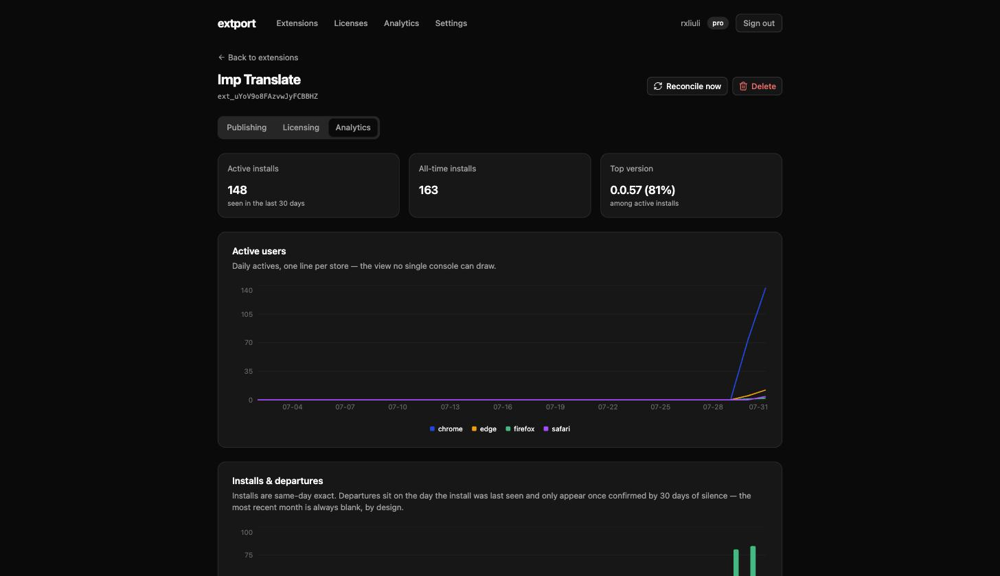

Analytics gives you the view no single store console can: weekly active users, installs, and version adoption
**combined across Chrome, Firefox, Edge, and Safari** in one dashboard, instead of checking four consoles by hand.
It's the same idea as [Publishing](/publishing/)'s one-dashboard-for-review-status, applied to usage.

The model in one sentence: your extension sends **one anonymous ping per install per day** — a random id, its
version, and the browser's UI language — and extport derives everything else (browser, OS, country) from the
request itself, server-side.

## 1. Turn it on

If your extension uses [`@extport/wxt`](https://www.npmjs.com/package/@extport/wxt), it's one flag:

```ts
// wxt.config.ts
export default defineConfig({
  modules: ['@extport/wxt'],
  extport: {
    extension: 'ext_…',
    analytics: true,
  },
})
```

This injects the daily ping into your background script and adds Firefox's data-collection declaration to the
manifest automatically — nothing to write in your own source.

Without the WXT module, call the SDK directly from your background entrypoint:

```ts
import { attachAnalytics } from '@extport/sdk/analytics'

attachAnalytics({ extensionId: 'ext_…' })
```

Either way, the ping is on by default (mirroring how Firefox's own install-prompt toggle works — on, with an easy
way to turn it off) and never throws: a network hiccup or a missing id just means no ping that day, never a broken
extension.

## 2. Declare it to the stores

Checking the box on your side isn't the whole story — each store store asks developers what data they collect, and
now there's a real (if minimal) answer. The exact fields the ping sends, and why each box is or isn't checked:

**Chrome Web Store** — under your listing's Privacy practices tab:

- Check **Location** — the ping's country comes from the request itself (Chrome's own example text names "region,
  IP address").
- Leave everything else unchecked — the ping carries no personal identifiers, no behavioral data, and no browsing
  history.
- Checking any box makes the listing's **privacy policy URL** field required — link to your own policy describing
  this (a short template: random install id, version, language, IP used only for the country lookup and never
  stored, 90-day raw retention).

**Firefox** — nothing to fill in by hand. The `technicalAndInteraction` data-collection declaration is added to
your manifest automatically (by `@extport/wxt`, or your own `browser_specific_settings.gecko.data_collection_permissions`
if you're wiring the SDK directly) — Firefox shows it in the install prompt and lets users manage it later under
`about:addons`. Your listing still needs a privacy policy link.

**App Store Connect** (Safari-shipping extensions) — under App Privacy:

- Data type: **Identifiers → Device ID**.
- Purpose: **Analytics**.
- Linked to the user's identity: **No**.
- Used for tracking: **No** — this isn't the third-party data linkage Apple's "tracking" definition covers.

**Edge Add-ons** — no separate data-disclosure form as of writing; the same privacy policy link covers it.

## 3. Read the dashboard

Open your extension's **Analytics** tab. Every chart reads straight from the daily rollup:



- **Active users** — weekly actives (rolling 7 days, the same metric the Chrome Web Store console headlines), one
  line per store, so a review going sideways on one store or a release adopting slowly shows up as that store's line
  diverging from the others. A weekly window also absorbs the natural day-to-day jitter of extension usage — a
  browser that stays closed for a day isn't a lost user.
- **Weekly users by country / language / OS** — top 5 + Other for each, over the same rolling week.
- **Installs & departures** — same-day-exact installs; departures are covered below.
- **Version saturation** — daily actives stacked by version, so a release's adoption curve visibly eats the layer
  below it. This is the number to watch before assuming an old version's users are gone.

## How the rest behaves

- **The chart window is fixed and always ends yesterday** — the last day fully rolled up, same convention the store
  consoles themselves use. Days without data still draw as zero, so a new install shows up as a line rising out of a
  flat month, not a floating point.
- **Departures are confirmed, not guessed.** An install is counted as departed only after 30 days of silence, and
  the count is attributed back to the day it was *last seen* — not the day the 30-day window closed. That means the
  most recent month never shows departures yet; give it time rather than reading a flat trailing edge as "nobody's
  leaving."
- **Firefox's own toggle is respected automatically.** If someone declines `technicalAndInteraction` at install (or
  turns it off later in `about:addons`), the SDK checks that permission fresh on every ping — no code of yours needs
  to react to it.
- **Nothing here is behavioral.** No URL, no page content, no feature usage — the wire protocol is exactly one event
  (the daily ping), so there's nothing to add and nothing to accidentally over-collect.
