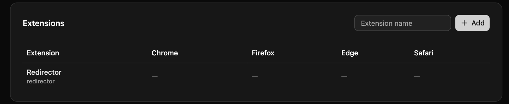
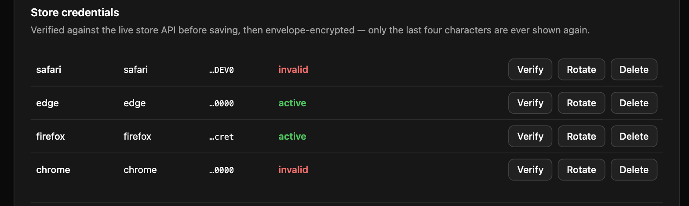
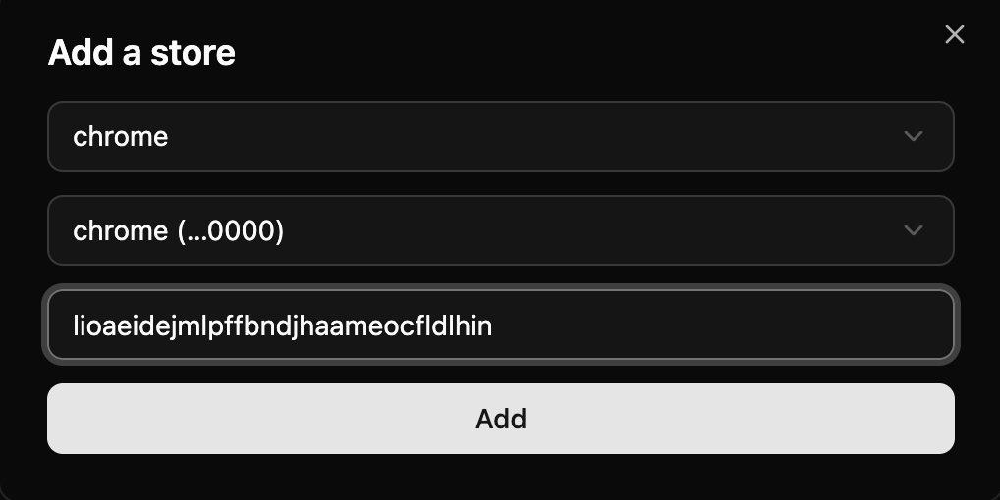
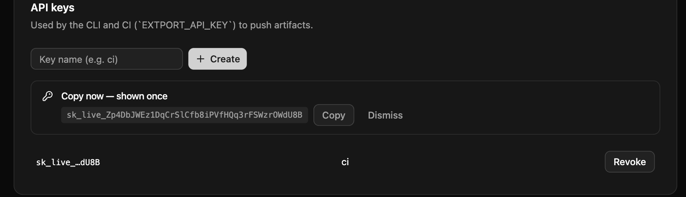

extport is currently in closed beta — new accounts are reviewed by hand. Sign in once and you'll either land in the
dashboard right away, or see a waiting screen until your account is activated. [Join the Discord](https://discord.gg/Va9kcSqu3f)
to reach us directly while you wait.

The examples on this page and the store pages all use one real, published extension — [Redirector](https://store.rxliuli.com/extensions/redirector/),
which ships on all four stores — so every id shown is something you can look up yourself, not a placeholder.

## 1. Sign in

Go to [dash.extport.dev](https://dash.extport.dev) and sign in with GitHub.

## 2. Create an extension

Click **Add** and give it a name. This is the thing you'll push versions to — one extension can have a target
configured for each of Chrome, Firefox, Edge, and Safari.



## 3. Add your store credentials

Under **Settings → Store credentials**, add a credential for each store you publish to. Each row shows the store,
a label, the last four characters of the credential, and whether it verified successfully:



See the per-store pages for exactly which fields you need and where to find them:

- [Chrome](/stores/chrome/)
- [Firefox](/stores/firefox/)
- [Edge](/stores/edge/)
- [Safari](/stores/safari/)

## 4. Connect a store target

Open your extension and click **Add a store**. This is where the store's own listing id and one of your credentials
get linked together — for Redirector on Chrome, that's its real item id, `lioaeidejmlpffbndjhaameocfldlhin`
(from its [Chrome Web Store listing](https://chromewebstore.google.com/detail/redirector/lioaeidejmlpffbndjhaameocfldlhin)):



## 5. Get an API key

Under **Settings → API keys**, name a key and click **Create**. The full value is shown exactly once — copy it
immediately, since only the last four characters are shown afterward:



This is what the CLI and GitHub Actions use to push on your behalf — treat it like a password.

## 6. Push a build

Either from your own machine:

```sh
npx extport login
npx extport push dist/my-extension.zip --extension ext_yourExtensionId --version 1.0.0
```

Or from CI, using the published GitHub Actions:

```yaml
- uses: extport-dev/actions/push@v1
  with:
    api-key: ${{ secrets.EXTPORT_API_KEY }}
    extension: my-extension
    zip-path: dist/my-extension.zip
```

Omit `--store`/`store:` to push a universal zip to every store target you've configured for that extension, or
target one store specifically (e.g. for Firefox's separate source-zip requirement). Safari has no zip upload at
all — it's built and signed locally via `extport safari-build`, see the [Safari](/stores/safari/) page.

## Shell completion

`extport completion bash|zsh|fish` prints a Tab-completion script for subcommands, flag names, and the values of
`--store`/`--platform`. It only prints — add the right line to your shell's own config to make it stick, same as
`gh`/`kubectl`/`rustup`:

```sh
# ~/.zshrc
eval "$(extport completion zsh)"

# ~/.bashrc
eval "$(extport completion bash)"

# ~/.config/fish/config.fish
extport completion fish | source
```

Open a new terminal (or `source` the file you just edited) to pick it up. The shell name is optional — omit it
(`extport completion`) and it detects the one you're currently running.
