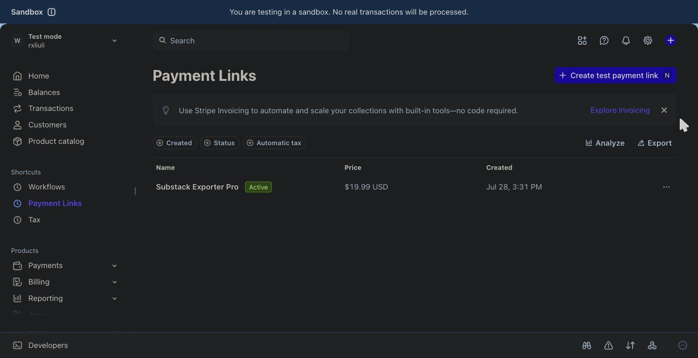
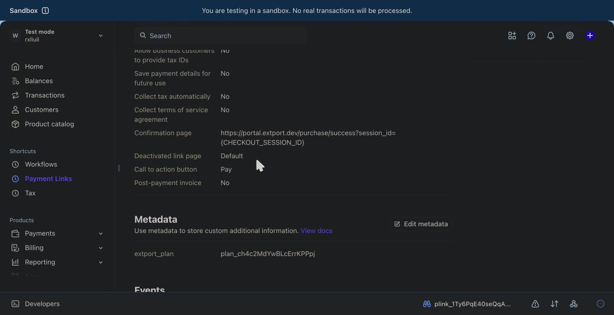
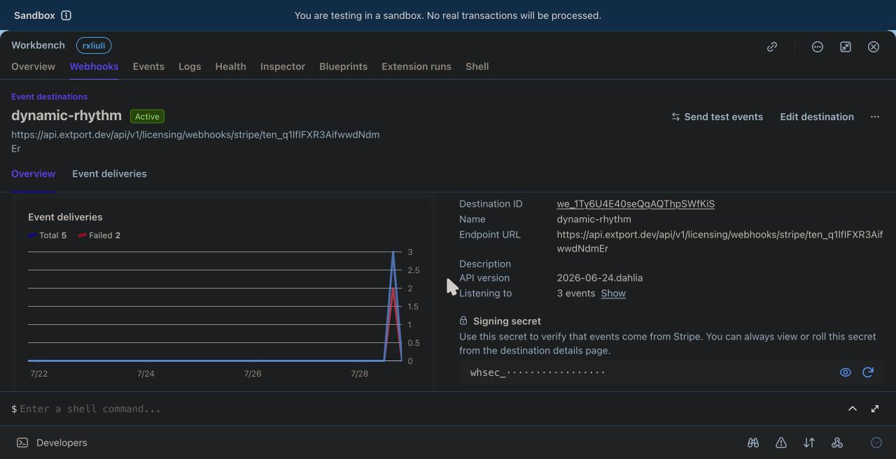

Licensing turns an extension into a paid product without you running any
server: you define a **plan** (what a buyer gets), sell it through your
own **Stripe Payment Link**, and extport handles everything after the
payment — issuing the activation code, emailing it, showing it on the
checkout success page, verifying activations from the extension, and
revoking on refunds.

The model in one sentence: the extension verifies codes **online** via
[`@extport/sdk`](https://www.npmjs.com/package/@extport/sdk) and caches
the entitlement locally — no cryptography in the client, no license
server of your own.

## 1. Enable licensing and create a plan

On your extension's page in the dashboard, open the **Licensing** tab and
enable licensing (this only turns the public verification endpoints on —
nothing changes for users until your extension ships licensing code).

Then create a plan. A plan is one sellable tier of one extension:

- **Tier** — the level the SDK resolves (e.g. `pro`). `free` is reserved
  for the unpaid tier.
- **Max devices** — how many devices one license covers (editable later;
  applies to codes issued from then on).

Activation codes verify against your **extension's id** (`ext_…`) — the
identity is part of the verification contract baked into shipped builds,
which is also why the extension's name is locked while licensing is
enabled.

The plans table shows a `extport_plan=plan_…` value per row — that's the
Stripe metadata you'll need in step 3.

## 2. Wire up the SDK

```ts
import { createActivationClient } from '@extport/sdk'
import { webextTransport } from '@extport/sdk/webext'

export const client = createActivationClient({
  // extensionId resolves automatically when built with @extport/wxt
  // (extport: { extension: 'ext_…' }); otherwise pass it here:
  // extensionId: 'ext_…',
  plans: {
    free: { records: 100 },               // 'free' is required
    pro: { records: Infinity },           // tier names = your plan tiers
  },
  transport: webextTransport(),
})

// in your UI: activate once, then the plan resolves locally
await client.activate('XXXX-XXXX-XXXX-XXXX')
const plan = await client.getPlan()       // { tier: 'pro', limit: … }
```

Call `attachBackground(client)` (from `@extport/sdk/webext`) in your
background entrypoint so activations sync across contexts and re-verify
on browser startup. Verification failures caused by network problems
never revoke anything — only a definitive server answer does.

Before touching Stripe you can already test the full loop: issue a
license by hand from the dashboard's Licensing tab and activate it in a
dev build.

## 3. Create the Payment Link

In Stripe (start in **test mode** — the Sandbox banner should be
visible), create a Payment Link for your product's price. None of the
optional checkout fields are needed; extport only uses the buyer's email,
which Stripe always collects.



Two settings on the link matter. **After payment** is part of the creation form itself; **Metadata** isn't — Stripe
only exposes it once the link already exists, from its detail page:

1. **After payment** (set while creating the link, or later via edit → *After payment* tab): redirect to

   ```
   https://portal.extport.dev/purchase/success?session_id={CHECKOUT_SESSION_ID}
   ```

   so buyers land on a page that shows their activation code the moment
   the payment settles (`{CHECKOUT_SESSION_ID}` stays literal — Stripe
   fills it in). Skipping this works too — the code still arrives by
   email — but the redirect is the smoothest experience.
2. **Metadata** (only after creating the link, from its detail page →
   *Edit metadata*): add one entry, key `extport_plan`, value the
   `plan_…` id from your plans table. This is how a payment finds the
   plan to fulfill — without it, extport ignores the sale.



Enable *Allow promotion codes* under Advanced options if you use
discount codes.

## 4. Point a webhook at extport

In Workbench → **Webhooks**, add an event destination:

- **URL**: `https://api.extport.dev/api/v1/licensing/webhooks/stripe/<your tenant id>`
  — the exact URL is shown ready-to-copy in [**Settings → Payment
  credentials**](https://dash.extport.dev/settings#payment-credentials).
- **Events**: `checkout.session.completed`, `charge.refunded`,
  `charge.dispute.created` — the first fulfills purchases, the other two
  revoke licenses automatically on refunds and disputes.
- **Payload style**: Snapshot (the default).



Then copy the destination's **signing secret** (`whsec_…`) into
extport's [**Settings → Payment
credentials**](https://dash.extport.dev/settings#payment-credentials). The secret is write-only —
extport uses it solely to verify that webhook events really come from
Stripe. Test and live mode have separate secrets; store whichever mode
your sales currently run in.

## 5. Buy one

Open your Payment Link and pay with Stripe's test card
`4242 4242 4242 4242` (any future expiry, any CVC). Within seconds:

- the success page shows the activation code,
- the same code lands in the buyer's inbox,
- a license row appears in your Licensing tab (source `stripe`),
- and the code activates inside your extension.

When you're ready to sell for real, repeat steps 3–4 in live mode (a new
Payment Link, a new webhook destination, and its live `whsec_…` replacing
the test one in Settings).

## How the rest behaves

- **Refunds revoke.** A `charge.refunded` or dispute flips the license to
  `refunded`; the buyer's devices lose the entitlement on their next
  online check.
- **Seats decay lazily.** A device idle for 30 days frees its seat
  automatically the moment another device wants one — reinstalls never
  wedge a license permanently. You can also release a seat by hand from
  the license's Devices dialog.
- **Buyers help themselves.** [portal.extport.dev](https://portal.extport.dev/portal)
  lets buyers sign in with their purchase email (magic link, no
  password) and see every code and device they own.
- **Codes outlive everything.** Issued licenses keep verifying no matter
  what plan you're on — and if verification is ever unreachable,
  activated devices keep working from local state. The failure mode is
  always "no new activations", never "paid features turn off".
