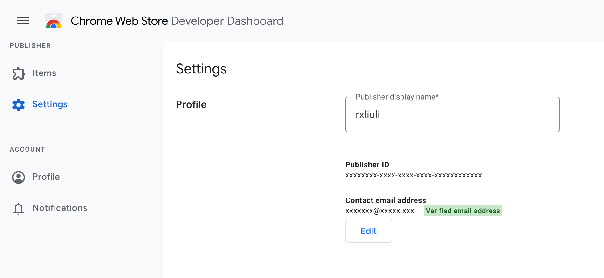

extport publishes to the Chrome Web Store using a Google Cloud **service account** and the [Chrome Web Store Publish API](https://developer.chrome.com/docs/webstore/api_index/) —
the same mechanism `chrome-webstore-upload` and similar CI tools use, not your personal Google login.

## Credential fields

Under **Settings → Store credentials → Chrome**, extport asks for:

| Field | Where it comes from |
| --- | --- |
| Publisher ID | [Chrome Web Store Developer Dashboard](https://chromewebstore.google.com/devconsole) → Settings → Profile |
| Service Account Email | The `client_email` field in your service account's downloaded JSON key |
| Service Account Private Key | The `private_key` field in the same JSON key |

To create the service account: in [Google Cloud Console](https://console.cloud.google.com/apis/library/chromewebstore.googleapis.com),
enable the **Chrome Web Store API** for your project, create a service account, generate a JSON key for it, then
grant that service account access from the Chrome Web Store Developer Dashboard's account settings.

## Store item id

The **store item id** is the id in your item's [Developer Dashboard](https://chromewebstore.google.com/devconsole)
URL or its public store listing URL — a 32-character lowercase string.

For example, [Redirector](https://store.rxliuli.com/extensions/redirector/)'s Chrome listing is at
`chromewebstore.google.com/detail/redirector/`**`lioaeidejmlpffbndjhaameocfldlhin`** — that trailing segment is
the store item id.

## Notes

- The Chrome Web Store API applies its own review process independent of extport — extport only submits, it can't
  speed up or bypass review.
- Uploading a new version does not publish it automatically to all trusted testers/rollout groups; that behavior is
  controlled by your existing Chrome Web Store publish settings, not by extport.
