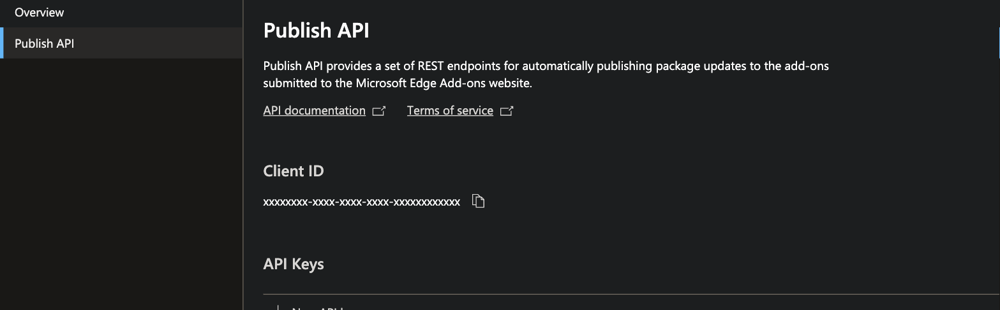
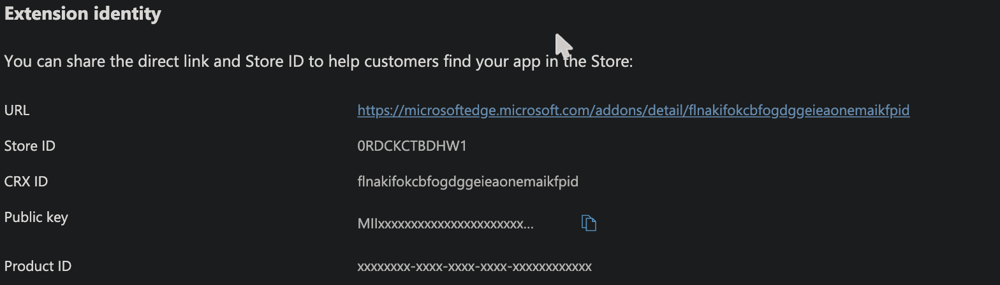

extport publishes to Edge Add-ons using [Partner Center's Submission API](https://learn.microsoft.com/en-us/microsoft-edge/extensions-chromium/publish/api/using-addons-api).

## Credential fields

Under **Settings → Store credentials → Edge**, extport asks for:

| Field | Where it comes from |
| --- | --- |
| Client ID | [Partner Center → Edge → Publish API](https://partner.microsoft.com/en-us/dashboard/microsoftedge/publishapi) → Client ID |
| API Key | Same page → New API key |

A single Client ID/API key pair covers every extension on that Partner Center account — you don't need one per
extension.

## Product id and crx id

Edge is the one store with two different ids for the same listing:

| Field | Used for | Where it comes from |
| --- | --- | --- |
| Product ID | Required — the Submission API's internal GUID | Partner Center → your extension → Extension identity |
| CRX ID | Optional | The store-facing id shown on the extension's public Edge Add-ons page |

Product ID is what actually publishes; CRX ID only helps extport detect the live version between reconcile ticks
when the Submission API itself can't report status.

For example, [Redirector](https://store.rxliuli.com/extensions/redirector/)'s Edge listing has Product ID
`fc0018c2-ecb8-4305-8ccf-b700cc62aba7` and CRX ID `jhdjcofnjfeljeekjklhgfmfocfgibmm` — the CRX ID is also the
trailing segment of its public listing URL, `microsoftedge.microsoft.com/addons/detail/redirector/`**`jhdjcofnjfeljeekjklhgfmfocfgibmm`**.
