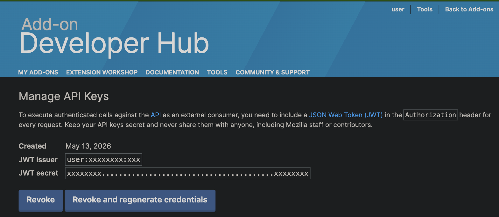

extport publishes to Firefox Add-ons (AMO) using its [JWT-based Add-on API](https://addons-server.readthedocs.io/en/latest/topics/api/auth.html) —
the same credentials the `web-ext sign` CLI and AMO's own API docs use.

## Credential fields

Under **Settings → Store credentials → Firefox**, extport asks for:

| Field | Where it comes from |
| --- | --- |
| JWT Issuer | [AMO Developer Hub → Manage API Keys](https://addons.mozilla.org/en-US/developers/addon/api/key/) → "JWT issuer" |
| JWT Secret | The same page, shown once when the key is generated |

If you don't already have API keys, generate a new key pair from the [Developer Hub](https://addons.mozilla.org/en-US/developers/addon/api/key/) —
regenerating invalidates the previous secret, so rotate the credential in extport's Settings right after.

## Store item id

The **store item id** is your add-on's id or slug, found in its AMO listing URL or in the Developer Hub's "Manage"
page for that add-on.

For example, [Redirector](https://store.rxliuli.com/extensions/redirector/)'s Firefox listing is at
`addons.mozilla.org/firefox/addon/`**`redirector-url`**`/` — that slug is the store item id.

## Source zip

AMO requires the original, unminified source alongside a minified/bundled submission. When pushing specifically to
Firefox (`--store firefox` / a Firefox-targeted push), you can attach a source zip alongside the build —
see [Getting started](/getting-started/) for the push command shape.
