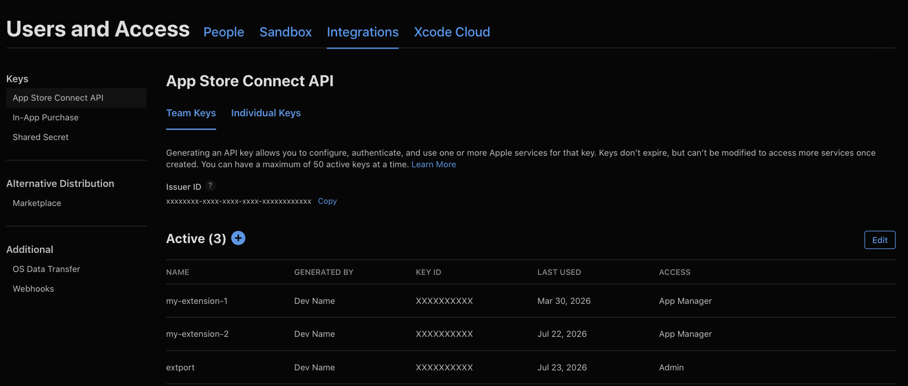
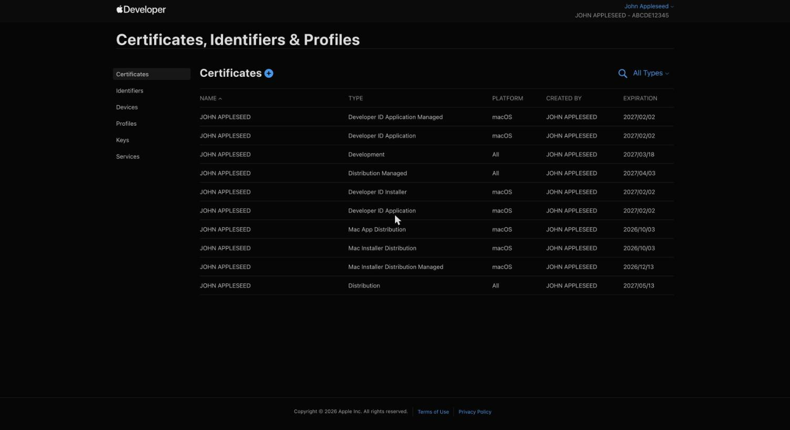

Safari is the odd one out: there's no zip upload through extport at all. The build itself is compiled, code-signed,
and uploaded straight to App Store Connect from your own machine (or CI runner) via `extport safari-build` — extport
only tracks version/review status afterward.

## Credential fields

Under **Settings → Store credentials → Safari**, extport asks for:

| Field | Where it comes from |
| --- | --- |
| Key ID | [App Store Connect → Users and Access → Integrations → App Store Connect API](https://appstoreconnect.apple.com/access/integrations/api) → your key's "KEY ID" column |
| Issuer ID | Same page, shown above the key list as "Issuer ID" |
| .p8 Private Key | Downloaded once when the key is created — App Store Connect never lets you re-download it |



### The key's role must be Admin

This is the part that isn't obvious from Apple's own docs: cloud code signing (`xcodebuild -allowProvisioningUpdates`,
which is what `extport safari-build` uses) needs an API key with the **Admin** role specifically — the "Access"
column in the screenshot above. Developer or App Manager roles can authenticate fine but fail partway through
signing with a "Cloud signing permission error" — confirmed against Apple's real API, not just the docs. If you hit
that error, generate a new key with the Admin role and rotate the credential in both extport's Settings and your CI
secrets.

## Store item id

The Safari **store item id** is your app's Apple ID (the numeric App Store Connect app id), not the bundle id.

For example, [Redirector](https://store.rxliuli.com/extensions/redirector/)'s iOS app is at
`apps.apple.com/app/url-redirector/id6743197230` — the trailing `6743197230` is the store item id. Pasting the
whole App Store URL into the dashboard's store item id field also works — it extracts the id for you.

## Building and uploading

In a WXT project with [`@extport/wxt`](/wxt/)'s `safari` block configured
(or after `extport init`'s interactive Safari setup), everything `extport safari-build` needs — project path,
Team ID, issuer id, key id — is already in `extport.config.json`, so locally it's just:

```sh
npx extport safari-build
```

Outside that setup, pass them as flags: `--project-path ./ios --team-id ABCDE12345 --issuer-id … --key-id …`.
The `.p8` key file itself is found the same way Apple's own tools look for it — `AuthKey_{KEY_ID}.p8` in
`./private_keys`, `~/private_keys`, `~/.private_keys`, or `~/.appstoreconnect/private_keys` — or point at it
directly with `--key-path`.

From CI, the secrets are passed in explicitly — project path and Team ID still infer from `extport.config.json`:

```yaml
- uses: extport-dev/actions/safari-build@v1
  with:
    # project-path/team-id inferred from extport.config.json (synced by @extport/wxt)
    issuer-id: ${{ secrets.APPLE_API_ISSUER }}
    key-id: ${{ secrets.APPLE_API_KEY_ID }}
    key-base64: ${{ secrets.APPLE_API_KEY }}
    certificate-base64: ${{ secrets.APPLE_CERTIFICATE_BASE64 }}
    certificate-password: ${{ secrets.APPLE_CERTIFICATE_PASSWORD }}
```

This builds and uploads every platform your Xcode project ships (macOS and/or iOS) — Safari's macOS and iOS
listings run fully independent review timelines under the same App Store Connect app.

## The signing certificate

`certificate-base64`/`certificate-password` are technically optional, but skipping them on CI will eventually break
your builds. A GitHub-hosted runner's keychain starts empty every run, so without a certificate already sitting in
it, cloud signing asks Apple to mint a brand new one each time — and since that certificate's private key is
destroyed with the runner at the end of the job, it's unusable ever again. Every run silently burns one certificate
for good until your Apple Developer account hits its cap on how many it'll allow, at which point every build starts
failing with "Your account has reached the maximum number of certificates."

The fix is to create **one** certificate yourself and reuse it everywhere: it's tied to your Apple Developer
account, not any one app, so the same `.p12` signs every extension you build.

### Where the certificate comes from

This is a different credential from the App Store Connect API key above — it lives on the
[Apple Developer → Certificates](https://developer.apple.com/account/resources/certificates/list) page, and
creating one is a three-step dance between that page and the Keychain Access app on your Mac:



1. **Generate a signing request (CSR) on your Mac.** Open **Keychain Access** (in `/Applications/Utilities`), then
   menu bar → **Keychain Access → Certificate Assistant → Request a Certificate From a Certificate Authority…**
   Fill in your email, leave "CA Email Address" empty, choose **Saved to disk**, and save the
   `CertificateSigningRequest.certSigningRequest` file.
2. **Create the certificate on Apple's site.** On
   [the Certificates page](https://developer.apple.com/account/resources/certificates/list), click **+**, choose
   **Apple Distribution** (one certificate covers both the Mac App Store and iOS App Store), upload the CSR file,
   and download the resulting `.cer`.
3. **Install and export as `.p12`.** Double-click the downloaded `.cer` to add it to your keychain, then in
   Keychain Access under **My Certificates**, right-click the new "Apple Distribution: …" entry →
   **Export…** → file format **Personal Information Exchange (.p12)** — it will ask you to set an export
   password. (The `.p12` bundles the certificate *with its private key*, which only exists in the keychain that
   generated the CSR — that's why the export has to happen on the same Mac.)

Then encode it and store both halves as repo secrets:

```sh
base64 -i Certificates.p12 | pbcopy   # → APPLE_CERTIFICATE_BASE64
# the export password you chose      # → APPLE_CERTIFICATE_PASSWORD
```

Treat the `.p12` and its password like a production key: anyone holding both can sign software as you. Delete the
local file once the secrets are stored.
